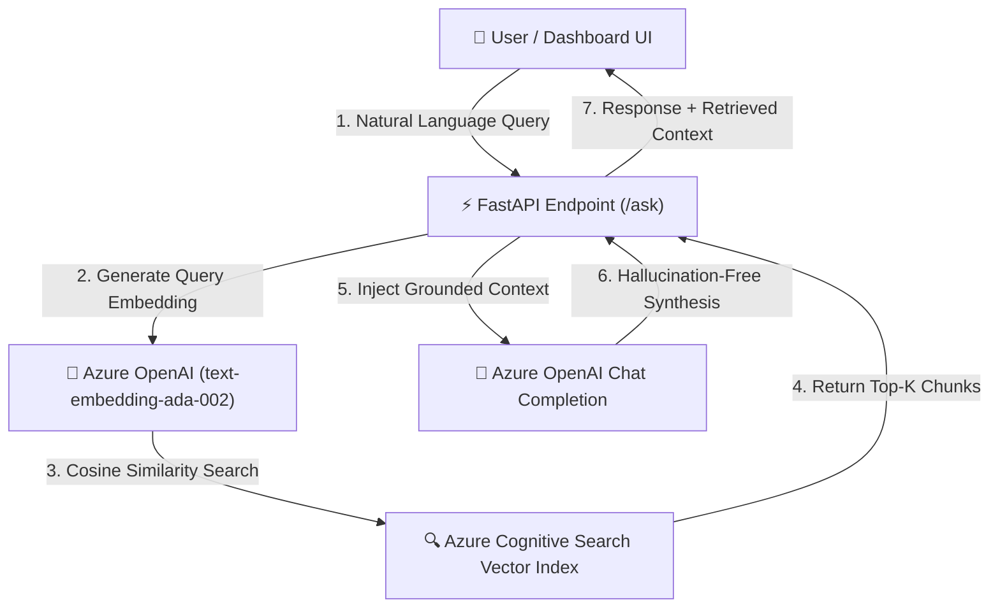

# Azure RAG Studio Pro ⚡

[](https://github.com/ianuj-yadav)
[](#)
[](#)
[](#)
[](LICENSE)

**Azure RAG Studio Pro** is an AI-native **Retrieval-Augmented Generation (RAG)** platform and interactive web dashboard architected and designed by **Anuj Yadav**. It integrates **Azure Cognitive Search** vector retrieval with **Azure OpenAI Service** embeddings and chat completions, wrapped in a responsive dark-mode glassmorphic interface.

---

## ✨ Key Features & Highlights

- **Bespoke Glassmorphic Dashboard UI:** Beautiful obsidian dark-mode interface with subtle neon accents, animated status badges, interactive prompt chips, and a built-in **Brand Settings Modal** to customize developer branding on the fly.
- **Real-Time Vector Context Inspector:** Inspect top-$k$ similarity chunks retrieved from Azure Cognitive Search right inside the dashboard sidebar before context injection.
- **Production-Ready FastAPI Backend:** High-performance REST APIs (`/ask`) with integrated Swagger documentation available at `/docs`.
- **Intelligent Fallback Simulation:** Seamlessly run and demonstrate the RAG pipeline locally even before provisioning Azure cloud keys.

---

## 🏗️ System Architecture



---

## 🚀 Getting Started

### 1. Prerequisites
- Python 3.10+
- Azure OpenAI Resource & Azure Cognitive Search instance (optional for local simulation mode)

### 2. Installation & Virtual Environment

```bash
# Create and activate virtual environment
python -m venv .venv
# On Windows:
.venv\Scripts\activate

# Install dependencies
pip install -r requirements.txt
```

### 3. Environment Variables (.env)

Create a `.env` file inside the root directory:

```env
OPENAI_API_BASE=https://<your-resource-name>.openai.azure.com/
OPENAI_API_KEY=<your-azure-openai-key>
SEARCH_SERVICE_NAME=https://<your-search-service>.search.windows.net
SEARCH_API_KEY=<your-search-admin-key>
SEARCH_INDEX_NAME=wine-ratings-index
```

### 4. Running the Dashboard & API Server

Start the application using `uvicorn`:

```bash
uvicorn webapp.main:app --reload --host 0.0.0.0 --port 8000
```

- **Interactive UI Dashboard:** Open `http://localhost:8000/`
- **Swagger API Docs:** Open `http://localhost:8000/docs`

---

## 🎨 Personal Brand Customization

Click the **Brand Settings** button in the top right of the dashboard to customize:
- Developer / Architect Name
- Role & Professional Title
- Project / Site Header Title

Changes persist seamlessly to local browser storage.

---

## 👤 Author & Ownership

Designed, engineered, and customized by **Anuj Yadav**.  
All rights reserved. Licensed under the MIT License.
